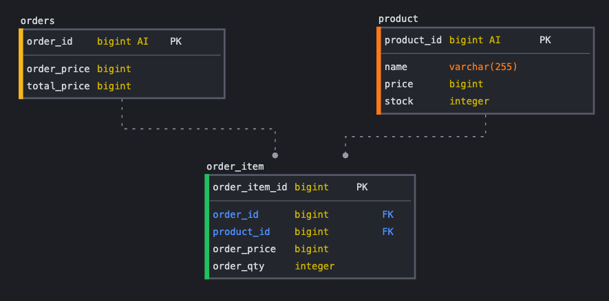
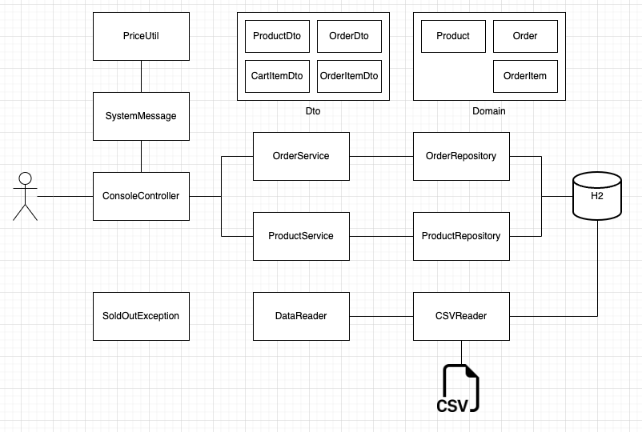

# 상품 주문 프로그램 개발

## 요구사항
* 상품 주문 프로그램을 작성합니다.
* 상품은 고유의 상품번호와 상품명, 판매가격, 재고수량 정보를 가지고 있습니다.
* 한 번에 여러개의 상품을 같이 주문할 수 있어야 합니다.
* 상품번호, 주문수량은 반복적으로 입력 받을 수 있습니다.
  * 단, 한번 결제가 완료되고 다음 주문에선 이전 결제와 무관하게 주문이 가능해야 합니다.
* 주문은 상품번호, 수량을 입력받습니다.
  * empty 입력 (space + ENTER) 이 되었을 경우 해당 건에 대한 주문이 완료되고, 결제하는 것으로 판단합니다.
  * 결제 시 재고 확인을 하여야 하며 재고가 부족할 경우 결제를 시도하면 SoldOutException 이 발생되어야 합니다.
* 주문 금액이 5만원 미만인 경우 배송료 2,500원이 추가되어야 합니다.
* 주문이 완료되었을 경우 주문 내역과 주문 금액, 결제 금액 (배송비 포함) 을 화면에 display 합니다.
* 'q' 또는 'quit' 을 입력하면 프로그램이 종료되어야 합니다.
* Test 에서는 반드시 multi thread 요청으로 SoldOutException 이 정상 동작하는지 확인하는 단위테스트가 작성되어야 합니다.
* 상품의 데이터는 하단에 주어지는 데이터를 사용해주세요
  * 데이터를 불러오는 방식은 자유입니다.
  * 코드에 포함되어도 좋고, 파일을 불러도 되고, in memory db 를 사용하셔도 됩니다.
  * 하지만 상품에 대한 상품번호, 상품명, 판매가격, 재고수량 데이터는 그대로 사용하셔 야 합니다.
  * 상품 데이터 csv 파일을 같이 제공합니다.

## 구현내용
### 개발환경
* java 11
* SpringBoot
* JPA
* H2
### ERD

### 흐름도

### 구현체 정보
* ConsoleController, SystemMessage
  * 콘솔 화면에서 입출력을 담당 
* DataReader
  * CSV 데이터를 로드하여 Product 테이블에 데이터 저장
* ProductService
  * 상품 조회 서비스
* OrderService
  * 주문 생성 서비스
* ProductRepository/OrderRepository
  * JPA 인터페이스
* SoldOutException
  * 재고 부족 에러 핸들러
* DTO
  * Presentation Layer
* Domain
  * Persistence Layer

### 검증 결과
* 비즈니스 요구사항 구현 완료
* @Test
  * 상품 주문 테스트 : ok
  * 상품 주문 동시 테스트 : ok
    * 재고 동시성 해결을 위한 Pessimistic Lock 설정
  * 상품 조회 테스트 : ok
  * 상품 전체 조회 : ok
  * csv 읽고 쓰기 : ok

